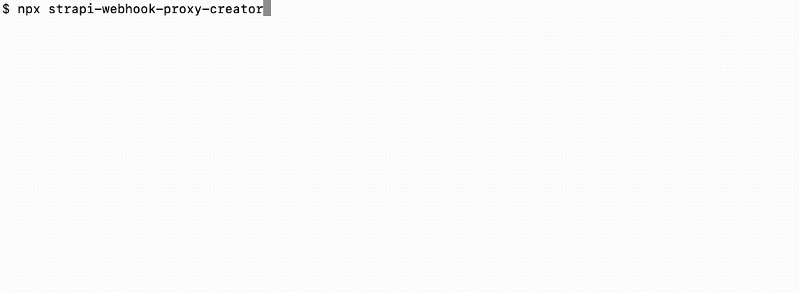

# Strapi Webhook Proxy Creator

A CLI tool that automates the setup of a webhook proxy in your Strapi project to trigger GitHub Actions workflows when content changes.

> 💡 **Credit**: This tool automates the manual implementation described in the article [Passing body data in Strapi webhooks triggering GitHub workflows example](https://u11d.com/blog/passing-body-data-in-strapi-webhooks-triggering-git-hub-workflows-example/).

## ✨ Features

- **Interactive Setup**: Select exactly which events (e.g., `entry.publish`, `media.create`) should trigger your build.
- **Automated Boilerplate**: Generates all necessary routes, controllers, and utility files in your `src/` directory.
- **Bootstrap Integration**: Automatically injects the setup logic into your Strapi `src/index.ts` bootstrap function.
- **Dependencies**: It installs `@types/koa` for type safety.

## 🚀 Usage

Run this command inside your Strapi project root:

```bash
npx strapi-webhook-proxy-creator
```



### What happens next?

After running the tool, you need to configure your environment variables. (Probably on your hosting platform, e.g., Strapi Cloud, Heroku, etc.)

```env
# GitHub Webhook Proxy
GITHUB_PAT=your_github_personal_access_token
GITHUB_URL=https://api.github.com/repos/YOUR_USERNAME/YOUR_REPO_NAME
GITHUB_EVENT_TYPE=strapi_triggers_github_workflow
```

- **GITHUB_PAT**: A GitHub Personal Access Token with `repo` scope.
- **GITHUB_URL**: The API URL for your repository.
- **GITHUB_EVENT_TYPE**: The custom event type name (defaults to `strapi_triggers_github_workflow`).

## Github Personal Access Token Setup

To create a GitHub Personal Access Token (PAT):

1. Go to your [personal access tokens in GitHub settings](https://github.com/settings/personal-access-tokens)
2. Pick "Fine-grained tokens"
3. Click "Generate new token", provide a name, set the expiration, and select the

> The fine-grained token must have the following permission set:
>
> "Contents" repository permissions (write)
>
> -- <https://docs.github.com/en/rest/repos/repos?apiVersion=2022-11-28#create-a-repository-dispatch-event>

## 📦 GitHub Actions Setup

To respond to the trigger, add the `repository_dispatch` event to your GitHub Actions workflow file (e.g., `.github/workflows/deploy.yml`):

```yaml
on:
  repository_dispatch:
    types: [strapi_triggers_github_workflow]

```
